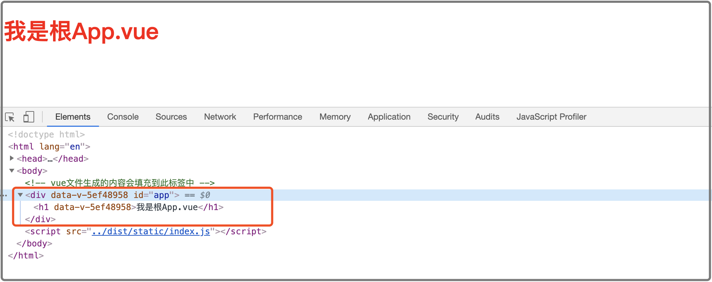

# 手动构建Vue项目

项目开发环境运行：npm run dev
项目生产环境运行：npm run build


手动构建vue项目需要准备好以下内容：

- 安装node

- 安装淘宝镜像：

  ```
  sudo npm install -g cnpm --registry=https://registry.npm.taobao.org
  ```

  


1. 进入demo02文件夹，生成package.json文件：

   ```
   cd demo02
   npm init
   ```


2. 安装依赖：

   你应该将 `vue-loader` 和 `vue-template-compiler` 一起安装——除非你是使用自行 fork 版本的 Vue 模板编译器的高阶用户。

   ```
   cnpm i --save webpack vue vue-loader vue-template-compiler
   ```

   安装成功后会提示，安装vue-loader后还需要安装css-loader，style-loader最好与css-loader一起使用，所以我们把这两个一起安装下：

   ```
   cnpm i --save css-loader style-loader
   ```

   本项目中还会使用vue router路由，安装vue-router：

   ```
   cnpm i --save vue-router
   ```

   

3. 新建文件夹及文件，目录结构如下：

   - demo02
     - node_modules  ------------------------------------------（安装依赖包后自动生成）
     - build  ---------------------------------------------------------（webpack构建文件）
       - webpack.dev.js  -------------------------------------（开发环境）
       - webpack.pro.js  -------------------------------------（生产环境）
     - src  -------------------------------------------------------------（页面目录）
       - router  ----------------------------------------------------（路由）
         - index.js
       - components  ------------------------------------------（组件）
       - views  ----------------------------------------------------（页面）
         - home.vue
       - images  --------------------------------------------------（图片）
       - styles  ----------------------------------------------------（样式）
       - js  ----------------------------------------------------------（js脚本）
       - App.vue
       - index.js
       - index.html
     - package.json

   

   demo02/src/index.html:

   ```html
   <!DOCTYPE html>
   <html lang="en">
   <head>
       <meta charset="UTF-8">
       <meta name="viewport" content="width=device-width, initial-scale=1.0">
       <!-- <%= htmlWebpackPlugin.options.title %> 动态设置title，后面详细讲解 -->
       <title><%= htmlWebpackPlugin.options.title %></title>
       <script src="../dist/static/index.js"></script>
   </head>
   <body>
       <!-- vue文件生成的内容会挂载到此标签上 -->
       <div id="container"></div>
   </body>
   </html>
   ```

   

   demo02/src/App.vue:

   ```vue
   <template>
       <div id="app">
           <h1>{{ title }}</h1>
           <router-view></router-view>
       </div>
   </template>
   
   <script>
       export default {
           name: 'App',
           data () {
               return {
                   title: '我是根App.vue'
               }
           }
       }
   </script>
   
   <!-- scoped的作用是指定css只对当前组件有效 -->
   <style scoped>
       h1 {
           color: red;
       }
   </style>
   ```

   

   demo02/src/index.js:

   ```js
   import Vue from 'vue'
   import App from './app.vue'
   import router from './router'
   
   new Vue({
       router,
       render: h => h(App)
   }).$mount('#container')
   ```

   

   demo02/src/views/home.vue

   ```vue
   <template>
       <div class="home">
           我是home页面
       </div>
   </template>
   ```

   

   demo02/src/router/index.js

   ```js
   import Vue from 'vue';
   import Router from 'vue-router';
   import HomePage from '../views/home.vue';
   
   Vue.use(Router);
   
   export default new Router({
     routes: [
       {
         path: '/',
         name: 'home',
         component: HomePage
       }
     ]
   });
   ```

   

   package.json:  配置scripts脚本

   运行npm run dev就会执行build/webpack.dev.js文件

   运行npm run build就会执行build/webpack.pro.js文件

   ```
   {
     "name": "demo02",
     "version": "1.0.0",
     "description": "手动构建Vue项目",
     "main": "index.js",
     "scripts": {
       "test": "echo \"Error: no test specified\" && exit 1",
       "dev": "webpack --config build/webpack.dev.js",
       "build": "webpack --config build/webpack.pro.js"
     },
     "author": "Lqw",
     "license": "ISC",
     "dependencies": {
       "vue": "^2.6.11",
       "vue-loader": "^15.9.2",
       "webpack": "^4.43.0"
     }
   }
   
   ```

   

   webpack.pro.js：

   我们先随便写一个log

   ```
   console.log('webpack.pro.js');
   ```

   然后我们可以试着运行一下` npm run build`，这时会提示`One CLI for webpack must be installed`，我们执行

   `cnpm i --save-dev webpack-cli`

   安装成功后，再执行`npm run build`这时我们看到控制台可以打出log，还会提示一些错误，此时我们继续编辑webpack.pro.js文件：

   ```js
   const path = require('path')
   const VueLoaderPlugin = require('vue-loader/lib/plugin')
   
   const baseConfig = {
       // __dirname代表当前文件的目录
       entry: path.join(__dirname, '../src/index.js'),
       // output配置：会在demo02/dist/static目录下生成index.js文件
       output: {
           filename: 'index.js',
           path: path.join(__dirname, '../dist/static')
       },
       module: {
           rules: [
               {
                   test: /\.vue$/,
                   loader: "vue-loader"
               },
               {
                   test:/\.css$/,
   				use:[
   					'style-loader',
   					'css-loader'
   				]
   			}
           ]
       },
       plugins: [
           // 使用vue-loader徐额外引入此插件
           new VueLoaderPlugin()
       ]
   }
   
   module.exports = baseConfig;
   ```

   webpack.dev.js配置完成后，执行`npm run build`，我们可以看到`demo02/dist/static`目录下生成`index.js`文件，我们可以先手动在`demo02/src/index.html`中引入此js文件，浏览器打开index.html文件，已经可以访问到app.vue的内容了。

   

   但是在真实的项目中，自动在dist文件夹下生成index.html并且自动引入index.js才是好的结果，所以我们需要引入了另一个插件`html-webpack-plugin`。

   

4. 安装`html-webpack-plugin`

   ```
   cnpm i --save html-webpack-plugin
   ```

   安装好之后，修改一下webpack.pro.js，在plugins里面定义html插件

   ```js
   const path = require('path')
   const VueLoaderPlugin = require('vue-loader/lib/plugin')
   const HTMLPlugin = require('html-webpack-plugin')
   
   const baseConfig = {
       // __dirname代表当前文件的目录
       entry: path.join(__dirname, '../src/index.js'),
       // output配置：会在demo02/dist/static目录下生成index.js文件
       output: {
           filename: 'index.js',
           path: path.join(__dirname, '../dist/static')
       },
       module: {
           rules: [
               {
                   test: /\.vue$/,
                   loader: "vue-loader"
               },
               {
                   test:/\.css$/,
                 use:[
                   'style-loader',
                   'css-loader'
                 ]
               }
           ]
       },
       plugins: [
           // 使用vue-loader徐额外引入此插件
           new VueLoaderPlugin(),
           new HTMLPlugin({
               filename: '../index.html',
               template: 'src/index.html'
           })
       ]
   }
   
   module.exports = baseConfig;
   ```

   修改成功后，执行`npm run build`，在dist文件目录下生成index.html，这时我们可以直接在浏览器打开dist/index.html进行访问，生产环境的webpack配置先到此结束，优化的部分我们后面继续讲解。

   

5. webpack.dev.js：开发环境的webpack配置

   首先与生产环境不同的是我们需要开启server功能，安装webpack-dev-server插件

   ```
   npm i --save-dev webpack-dev-server
   ```

    webpack.dev.js配置如下：

   ```js
   const path = require('path')
   const VueLoaderPlugin = require('vue-loader/lib/plugin')
   const HTMLPlugin = require('html-webpack-plugin')
   
   const baseConfig = {
       mode: 'development',
       // __dirname代表当前文件的目录
       entry: path.join(__dirname, '../src/index.js'),
       // output配置：会在demo02/dist/static目录下生成index.js文件
       output: {
           filename: 'index.js',
           path: path.join(__dirname, '../dist/static')
       },
       module: {
           rules: [
               {
                   test: /\.vue$/,
                   loader: "vue-loader"
               },
               {
                   test:/\.css$/,
                 use:[
                   'style-loader',
                   'css-loader'
                 ]
               }
           ]
       },
       plugins: [
           // 使用vue-loader徐额外引入此插件
           new VueLoaderPlugin(),
           new HTMLPlugin({
               filename: 'index.html',
               template: 'src/index.html'
           })
       ],
       // 使调试变得更友好
       devtool: 'eval-source-map',
       devServer: {
           host: 'localhost',
           port: 3000,
         	// 开启服务后自动打开页面
           open: true
       }
   }
   
   module.exports = baseConfig;
   ```

   再修改一下package.json的dev命令：

   ```
       "dev": "webpack-dev-server --config build/webpack.dev.js"
   ```

    执行`npm run dev`，页面自动跳出，此时就可以访问了。

   devServer还提供了热重载功能（更改前端代码后页面自动刷新），修改webpack.dev.js：

   ```js
   const path = require('path')
   const VueLoaderPlugin = require('vue-loader/lib/plugin')
   const HTMLPlugin = require('html-webpack-plugin')
   const webpack = require('webpack')
   
   const baseConfig = {
       mode: 'development',
       // __dirname代表当前文件的目录
       entry: path.join(__dirname, '../src/index.js'),
       // output配置：会在demo02/dist/static目录下生成index.js文件
       output: {
           filename: 'index.js',
           path: path.join(__dirname, '../dist/static')
       },
       module: {
           rules: [
               {
                   test: /\.vue$/,
                   loader: "vue-loader"
               },
               {
                   test:/\.css$/,
                   use:[
                       'style-loader',
                       'css-loader'
                   ]
   						}
           ]
       },
       plugins: [
           // 使用vue-loader徐额外引入此插件
           new VueLoaderPlugin(),
           new HTMLPlugin({
               filename: 'index.html',
               template: 'src/index.html'
           }),
           new webpack.HotModuleReplacementPlugin(),
           new webpack.NoEmitOnErrorsPlugin
       ],
       // 使调试变得更友好
       devtool: 'eval-source-map',
       devServer: {
           host: 'localhost',
           port: 3000,
           // 开启服务后自动打开页面
           open: true,
           hot: true
       }
   }
   
   module.exports = baseConfig;
   ```

    修改成功后，重新启动（`npm run dev`）即可。

   

6. 整合webpack配置文件

   这个项目的基本功能已经实现了，我们可以进行一些优化，我们看到webpack的两个文件有很多重复的部分，我们可以把重复的部分提取出来，build下新增一个webpack.base.js文件：

   ```js
   // webpack.base.js
   
   const path = require('path')
   const VueLoaderPlugin = require('vue-loader/lib/plugin')
   
   const baseConfig = {
       mode: 'development',
       // __dirname代表当前文件的目录
       entry: path.join(__dirname, '../src/index.js'),
       // output配置：会在demo02/dist/static目录下生成index.js文件
       output: {
           filename: 'index.js',
           path: path.join(__dirname, '../dist/static')
       },
       module: {
           rules: [
               {
                   test: /\.vue$/,
                   loader: "vue-loader"
               },
               {
                   test:/\.css$/,
                   use:[
                       'style-loader',
                       'css-loader'
                   ]
   			}
           ]
       },
       plugins: [
           // 使用vue-loader徐额外引入此插件
           new VueLoaderPlugin()
       ]
   }
   
   module.exports = baseConfig;
   ```

   

   ```js
   // webpack.dev.js
   
   const baseConfig = require('./webpack.base');
   const HTMLPlugin = require('html-webpack-plugin')
   const webpack = require('webpack')
   
   baseConfig.mode = 'development';
   baseConfig.devtool = 'eval-source-map';
   baseConfig.devServer = {
       host: 'localhost',
       port: 3000,
       // 开启服务后自动打开页面
       open: true,
       hot: true
   };
   baseConfig.plugins.push(
       new HTMLPlugin({
           filename: 'index.html',
           template: 'src/index.html'
       }),
       // devServer中hot为true时需要增加以下插件
       new webpack.HotModuleReplacementPlugin(),
       new webpack.NoEmitOnErrorsPlugin
   )
   
   module.exports = baseConfig;
   ```

   

   ```js
   // webpack.pro.js
   
   const baseConfig = require('./webpack.base');
   const HTMLPlugin = require('html-webpack-plugin')
   
   baseConfig.mode = 'production';
   baseConfig.plugins.push(
       new HTMLPlugin({
           filename: '../index.html',
           template: 'src/index.html'
       })
   )
   
   module.exports = baseConfig;
   ```

   

   

